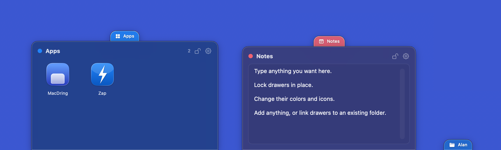

# MacDring

Screen-edge tabs that open drawers of your apps, files, folders, and links. Inspired by the classic **[DragThing](https://www.dragthing.com/)**.



Tabs sit against the edges of your screens. Click one and a
drawer slides out with whatever you put there. Drag files onto a tab to add them.
Works across multiple monitors, and your tabs return to exactly where you left
them after a restart.

> [!IMPORTANT]
> LLM Disclosure: MacDring was built with substantial help from large language models — primarily Anthropic's Claude, via Claude Code. Much of the code arrived through AI-authored commits and `claude/*` pull-request branches, with agent guidance kept in [`AGENTS.md`](AGENTS.md)

## Features

- **Edge tabs → drawers.** Colored tabs anchored to any screen edge; click (or
  hover) to open a drawer.
- **Six tab types** — an **items** tab (apps, files, folders, links arranged freely
  in a grid with gaps), a **notes** tab (a quick text scratchpad), a **folder** tab
  (a live, read-only view of a directory's contents), a **disks** tab (your mounted
  ejectable volumes), a **network** tab (your mounted network shares), and a
  **cloud** tab (your cloud drives — iCloud, Dropbox, …). See
  [the docs](docs/network-and-cloud-drives.md) for the network & cloud tabs.
- **Holds anything launchable** — applications, files, folders, and URLs. One
  click opens them.
- **Drag-and-drop to add.** Drop files or apps from Finder — or a link dragged from
  a browser's address bar — onto a tab or its open drawer.
- **Spring-loaded drops.** Drag a file onto a tab and its drawer springs open; the
  slot under your cursor **highlights**, and dropping there files the item into that
  slot — onto an app to open it with, onto a folder to move it in.
- **Trash item.** Add a Trash to any tab (Settings → Tabs → *Add Trash*): click it to
  open the Trash, or drop files onto it to throw them away.
- **Per-tab color, name, and glyph** (SF Symbol or letters).
- **Multi-monitor support.** Tabs live on a specific display + edge and
  react live to displays connecting, disconnecting, and changing resolution.
- **Stable restore.** Tabs return to the same display and spot after a restart,
  resolution change, or reconnection.
- **Optional per-tab hotkey** to toggle drawers.
- **Auto-hide / auto-fade tabs.** Set a tab to get out of the way when idle
  (**Settings → Tabs → When idle**): **Auto-hide** slides it off its edge leaving a
  thin sliver, **Auto-fade** dims it in place (opacity adjustable in **Settings →
  Appearance**). Reveals the moment you move the pointer to that screen edge.

## Build & Run

Requires **Xcode 16+** and **macOS 13+**.

```bash
# Build
xcodebuild -project MacDring.xcodeproj -scheme MacDring -configuration Debug build

# Release build
xcodebuild -project MacDring.xcodeproj -scheme MacDring -configuration Release build

# Run unit tests
xcodebuild -project MacDring.xcodeproj -scheme MacDring -destination 'platform=macOS' test
```

For day-to-day development, open `MacDring.xcodeproj` in Xcode and run.

## Usage

1. Launch MacDring — it appears as a sidebar icon in the menu bar, and a starter
   **Apps** tab appears on the right edge of your main display.
2. **Click the tab** to open its drawer; click an item to launch it.
3. **Drag files or apps** from Finder onto a tab to add them.
4. **Right-click a tab** → *Configure Tab…* to rename it, change its color/glyph,
   move it to another edge or display, set behavior, or assign a hotkey.
5. Use the menu bar → **New Items / Notes / Folder / Disks / Network / Cloud Tab…**
   to add more (a small dialog sets the name, color, type, and folder), or
   **MacDring Settings…** to manage everything. A **Disks** tab lists your mounted
   ejectable volumes; a **Network** tab lists your mounted network shares (click to
   open, eject from the menu); a **Cloud** tab lists your cloud drives such as iCloud
   Drive and Dropbox (click to open). See [the docs](docs/network-and-cloud-drives.md).

### Customizing

- **Per tab** (right-click → *Configure Tab…*, or **Settings → Tabs**): name,
  color, glyph, edge, display, position, open-on-hover/auto-hide/keep-open, and an
  optional hotkey.
- **Global** (**Settings → Appearance / General**): **tab style (modern/classic)**,
  drawer material, grid vs. list layout, icon size, corner radius, tab thickness,
  labels, single vs. double-click to open, animation speed, the multi-display
  disconnect policy, and launch at login.

## Permissions & Distribution

MacDring needs **no special permissions** for its core features — launching uses
`NSWorkspace`, and optional hotkeys use Carbon (no Accessibility grant). It ships
as a menu-bar agent (`LSUIElement`).
